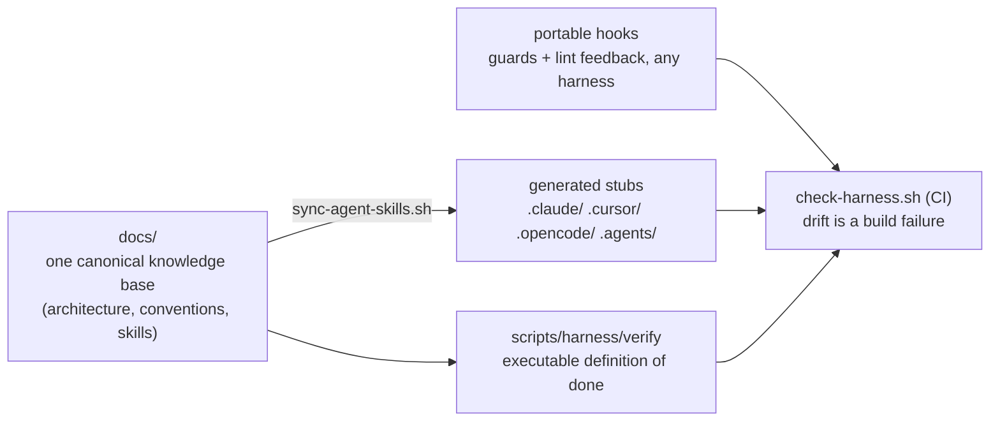

# harness-kit

**Harness Engineering for reliable coding agents — canonical context,
in-turn feedback, guardrails, executable verification, and continuous
improvement across Claude Code, Cursor, Codex, and OpenCode.**

[](https://github.com/Neogenuity/harness-kit/actions/workflows/ci.yml)
[](https://github.com/Neogenuity/harness-kit/actions/workflows/harness-check.yml)

A **harness** is the engineered environment around a coding agent: the context
it receives, the skills it can activate, the feedback and guardrails it gets,
the permissions it operates under, and the proof required before work is done.
harness-kit makes that environment a tested, continuously improving repository
system. Its cross-agent layer keeps the same system coherent wherever the work
runs, so teams do not accumulate conflicting vendor-specific configurations.



## This repo runs on itself

The root of this repository is a live installation of the kit — the same
`AGENTS.md`, `docs/`, vendored `scripts/`, provider wiring, and CI drift
gate it installs into your repo, produced by its own `init` flow. Browse it
as the example: start at [AGENTS.md](AGENTS.md), then
[ARCHITECTURE.md](ARCHITECTURE.md) for
how the pieces fit and
[docs/architecture/decisions/](docs/architecture/decisions/README.md) for
why they look the way they do. Only [plugins/harness-kit/](plugins/harness-kit/) ships to users;
everything else is the dogfood.

## What it installs into a target repo

- **`docs/` as the single source of truth** — architecture, conventions,
  skills, personas, indexed by an `AGENTS.md` table of contents (with a thin
  `CLAUDE.md` importing it).
- **An executable definition of "done"** — `scripts/harness/verify` holds the
  ordered quality gates; docs point at it instead of listing commands.
- **Generated provider stubs** — pointer stubs rendered into
  `.claude/.cursor/.opencode/.agents/skills/` with frontmatter copied
  verbatim, so activation triggers stay in sync everywhere.
- **Portable hooks** — plain bash, reading each harness's event JSON:
  post-edit lint feedback the agent self-corrects on, pre-read secret
  denial, pre-edit protection of the harness mechanism itself, an advisory
  stop-hook for project invariants (warns once, never hard-blocks), and a
  session-start orientation banner. Every guard ships with a regression
  test and logs to a git-ignored JSONL for the audit loop.
- **Shared permissions** — native deny lists mirroring the secret patterns;
  CI fails when the two layers drift apart.
- **A CI drift gate** — hand-edited stubs, stale syncs, dead doc links,
  non-executable hooks, failing hook tests, or un-pinned edits to mechanism
  files (manifest checksums) all fail the build.
- **Conditional runtime legibility for applications** — app-shaped repos can
  adopt a tailored, pinned `scripts/dev.sh` lifecycle plus a self-contained
  live-verification skill. Every repo receives the worktree-aware
  `scripts/harness/lib/dev-instance.sh` helper; libraries receive no placeholder runtime
  contract.

Everything is **vendored into the target repo**: nothing at runtime depends
on the kit being installed, so teammates on any harness — or none — get
identical behavior from a plain clone. The full pattern and its rationale:
[pattern.md](plugins/harness-kit/skills/harness-kit/references/pattern.md); per-provider
file locations and hook events (key facts carrying verification stamps, with
a Sources section to re-check against):
[provider-matrix.md](plugins/harness-kit/skills/harness-kit/references/provider-matrix.md).

## Install

The kit itself is one Agent Skill (`plugins/harness-kit/skills/harness-kit/`) — install
it into whichever agent will *run* the scaffolding. What it installs into
your repo is vendored and provider-agnostic either way: a harness
scaffolded from Claude Code works identically for Codex, Cursor, and
OpenCode sessions in that repo, and vice versa.

**Claude Code, as a plugin** (recommended — versioned, updatable via
`/plugin marketplace update`):

```
/plugin marketplace add Neogenuity/harness-kit
/plugin install harness-kit@harness-kit
```

Private marketplace repos work: installs and manual updates reuse your git
credentials (SSH key loaded in `ssh-agent`, or HTTPS via `gh auth login` /
credential helper); background auto-update additionally needs a
`GITHUB_TOKEN`/`GH_TOKEN` in the environment (verified 2026-07,
[plugin-marketplaces docs](https://code.claude.com/docs/en/plugin-marketplaces)).

**Claude Code, as a personal skill** (no plugin infrastructure):

```bash
git clone git@github.com:Neogenuity/harness-kit.git
cp -R harness-kit/plugins/harness-kit/skills/harness-kit ~/.claude/skills/harness-kit
```

**Codex, as a plugin** (recommended — versioned, updatable via the
`.agents/plugins/` marketplace channel, verified 2026-07-10,
[build-plugins docs](https://learn.chatgpt.com/docs/build-plugins)):

```bash
git clone git@github.com:Neogenuity/harness-kit.git
codex plugin marketplace add ./harness-kit      # registers the catalog
codex plugin add harness-kit@harness-kit        # installs the plugin
```

Then start a new Codex session and confirm the skill is available
(`codex plugin list`). `codex plugin marketplace add` registers the catalog
from `.agents/plugins/marketplace.json`, and `harness-kit` lists exactly once
— verified against Codex 0.144.1; the sibling `.claude-plugin/marketplace.json`
does not produce a duplicate registration.

**Codex, as a personal skill** (no plugin infrastructure) — Codex discovers
personal skills in `~/.agents/skills` (verified 2026-07,
[build-skills docs](https://learn.chatgpt.com/docs/build-skills)):

```bash
git clone git@github.com:Neogenuity/harness-kit.git
cp -R harness-kit/plugins/harness-kit/skills/harness-kit ~/.agents/skills/harness-kit
```

Copied installs update by `git pull` + re-copy. To offer the kit inside a
single repo instead, vendor the same directory at
`.agents/skills/harness-kit` — Codex and OpenCode read repo-level skills
from `.agents/skills/`.

One soft dependency: the installed hooks use `jq` to parse event payloads
and **fail open without it** — keep `jq` on PATH wherever agents run, or
the guards guard nothing.

**Supported platforms:** the installed hooks are bash + `jq`, and run on
macOS, Linux, WSL, and Git Bash on Windows. There is no native-Windows hook
execution — the kit's bash hooks assume a POSIX shell. Codex's
`commandWindows` override and other provider-specific Windows notes are
tracked per-provider in
[provider-matrix.md](plugins/harness-kit/skills/harness-kit/references/provider-matrix.md),
not duplicated here.

## Use

In any repo: *"set up the agent harness"* (init), *"audit the agent
harness"* (audit), *"add a harness skill for X"*, or *"upgrade the harness
machinery"* (update). On Codex, `$harness-kit` mentions the skill
explicitly (or pick it from `/skills`) when implicit matching doesn't
trigger. The skill intentionally interviews before writing: quality gates,
conventions worth documenting, first skills, and the one domain invariant
worth an advisory stop-hook.

## Layout

```
.claude-plugin/marketplace.json   marketplace manifest (points at plugins/harness-kit/)
plugins/harness-kit/              what ships: plugin manifest + the skill
  skills/harness-kit/             SKILL.md, references/, templates/
AGENTS.md, CLAUDE.md, docs/,      this repo's own installed harness
scripts/, .claude/ .cursor/ ...   (see "This repo runs on itself")
```

## Status

Extracted and generalized from a production Laravel modular monolith where
the pattern is exercised daily across multiple harnesses. Current version
lives in [`plugins/harness-kit/VERSION`](plugins/harness-kit/VERSION) and
[`CHANGELOG.md`](CHANGELOG.md). See [What 1.0 promises](#what-10-promises)
for the compatibility contract a version number carries. Pre-launch
checklist:

- [x] MIT license
- [x] Self-application (this repo runs its own harness, CI-gated)
- [x] Re-verify the provider matrix against current harness docs
      (re-validated 2026-07-14; hook event names are still evolving — check
      the per-fact stamps before wiring a provider you haven't used lately)
- [x] Tag releases — every release is tagged on its release commit. Update
      mode recovers the old template from the tag matching the manifest header
      when repository history is available, or from the installed pristine
      base for plugin-cache and plain-copy installs; both paths are regression
      tested in
      [docs/plans/completed/v0.14.0-provider-wiring-assurance.md](docs/plans/completed/v0.14.0-provider-wiring-assurance.md)
- [ ] Demo recording of `init` on a fresh repo — tracked in
      [docs/plans/active/launch-readiness.md](docs/plans/active/launch-readiness.md)
- [x] Moved to the `Neogenuity` org and updated install commands — tracked in
      [docs/plans/active/launch-readiness.md](docs/plans/active/launch-readiness.md)

## What 1.0 promises

Pre-1.0, mechanism behavior changes are already versioned — every change to
a shipped hook, gate, or script bumps at least a minor version (see
[.agents/skills/release/SKILL.md](.agents/skills/release/SKILL.md)) — but no
compatibility contract exists beyond that. 1.0 is where the contract starts.
It's stated in the kit's own vocabulary — mechanism, policy (`TAILOR`
blocks), and content — described in
[pattern.md](plugins/harness-kit/skills/harness-kit/references/pattern.md).

**Never touched by a template version bump, at any semver level:**

- Anything inside a `# -- TAILOR: ... --` block — the policy filled in at
  `init` (domain invariants, secret patterns added, provider choices).
  Update mode diffs tailored files against the new template; it never
  overwrites them.
- `harness.conf` and any other file the manifest marks `# tailored` — same
  diff-never-replace contract.
- **All content you authored in the target repo** — every file under `docs/`
  (architecture, conventions, agents, plans, evals, skills), plus `AGENTS.md`
  and `CLAUDE.md`. Update mode only ever processes the `scripts/` mechanism
  files the manifest pins, so authored content sits entirely outside its
  scope — never read, diffed, or overwritten by an upgrade.
- A mechanism file a release didn't change: update mode is a byte-for-byte
  no-op, verifiable with `git diff` before committing the bump.

**What each semver level means for a template version, once 1.0 ships:**

- **Patch** — bug fixes and doc-only changes. No installed mechanism file's
  *behavior* changes, though a checksum may (a fixed typo, a corrected
  comment) — replaced wholesale like any mechanism file.
- **Minor** — additive: a new hook, a new `verify.sh` gate, a new TAILOR
  point, a new provider. Existing non-tailored mechanism files may be
  replaced with new capability, but nothing that was passing starts failing,
  and no file left untouched by the target repo changes meaning underneath
  it without a corresponding new capability.
- **Major** — a breaking mechanism change: different behavior for the same
  hook event, a manifest/checksum format change, a shipped file renamed or
  removed, or any upgrade that needs a manual step beyond running the kit's
  update mode. Major-version migrations get a step-by-step note in
  `CHANGELOG.md` (the release skill's changelog step) and, for
  provider-landscape shifts specifically,
  [references/migrations.md](plugins/harness-kit/skills/harness-kit/references/migrations.md).

None of this is retroactive. 0.x releases today already treat mechanism
behavior changes as at least minor, but make no compatibility promise beyond
that — read the `CHANGELOG.md` entry for any 0.x bump before taking it.

## Security

Found a vulnerability in the shipped guard machinery? See
[SECURITY.md](SECURITY.md) for how to report it privately, the response
window, and which versions get fixes pre-1.0.

## License

[MIT](LICENSE)
