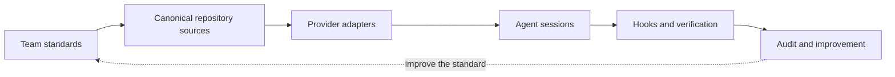
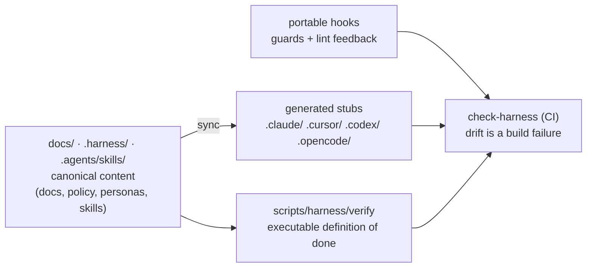

# harness-kit

**Establish one reliable engineering standard for every coding agent working
in your repository.**

[](https://github.com/Neogenuity/harness-kit/actions/workflows/ci.yml)
[](https://github.com/Neogenuity/harness-kit/actions/workflows/harness-check.yml)

Coding agents are easy to add and hard to operate consistently. Without an
engineered environment, each one discovers different context, follows a
different workflow, and interprets prose-only standards differently.

A **harness** is the engineered environment around a coding agent: the context
it receives, the skills it can activate, the feedback and guardrails it gets,
the permissions it operates under, and the proof required before work is done.
**harness-kit turns that environment into versioned, executable repository
infrastructure.** It gives teams canonical project context, repeatable
workflows, in-turn feedback, layered guardrails, quality gates, and an
improvement loop that can be reviewed and tested like code.

Teams author their standards once and project them into Claude Code, Cursor,
Codex, OpenCode, and compatible `.agents` consumers instead of maintaining
parallel vendor configurations. The result is more consistent agent behavior,
faster correction, safer execution, and auditable evidence that work is done.

**[Start with the quick start](#quick-start)** or
[see exactly what the kit installs](#what-it-installs).


```mermaid
flowchart LR
    T["Team standards"]
    C["Canonical repository sources"]
    A["Provider adapters"]
    S["Agent sessions"]
    V["Hooks and verification"]
    I["Audit and improvement"]
    T --> C --> A --> S --> V --> I
    I -. "improve the standard" .-> T
```

## Why harness-kit?

| Project problem | Harness capability | Team benefit |
| --- | --- | --- |
| Knowledge is scattered or repeatedly explained | Canonical `AGENTS.md`, `docs/`, `.harness/`, and `.agents/skills/` sources | Agents begin with the same project understanding |
| Different agents receive different instructions | Generated provider adapters | Standards change once and propagate consistently |
| Prose guidance is ignored or becomes stale | Hooks and executable quality gates | Problems surface during the turn and are verified before completion |
| Provider configuration drifts | Sync checks, manifests, and CI enforcement | Divergence becomes a build failure |
| Agent failures recur without learning | Audits, local outcome telemetry, and evals | Teams improve the harness instead of repeatedly correcting individual sessions |

## How it establishes Harness Engineering standards

harness-kit does not impose a generic coding standard. It inspects the real
repository, asks the team about the decisions that cannot be inferred, and
turns **that project's standards** into a durable operating system for coding
agents:

- **Canonical context** — architecture, conventions, plans, security policy,
  and runbooks have one discoverable source instead of competing prompt files.
- **Repeatable workflows** — skills and specialist personas encode how the
  project expects recurring tasks to be performed.
- **Fast feedback** — where provider surfaces support them, portable hooks
  return formatting, lint, secret-access, and project-invariant findings while
  the agent can still correct its work.
- **Layered guardrails** — repository policy, native provider permissions, and
  CI checks reduce risky behavior without pretending a hook is a security
  boundary.
- **Executable verification** — one ordered gate runner defines "done"; local
  outcome logs, audits, and evals show where the harness should improve next.

The installed system separates ownership so project standards remain stable
while the machinery can evolve:

| Layer | Owned by | Examples | Upgrade behavior |
| --- | --- | --- | --- |
| **Mechanism** | harness-kit | Hook runtime, verification runner, sync and integrity checks | Versioned, manifest-pinned, and safely replaceable |
| **Policy** | The adopting project | Quality gates, secret patterns, provider choices, project invariants | Tailored during adoption and never silently overwritten |
| **Content** | The adopting project | Architecture docs, conventions, plans, skills, and personas | Authored for the repository and outside automatic upgrades |

Adoption is a guided engineering workflow, not a blind scaffold:

1. **Inspect** the stack, existing instructions, quality gates, providers,
   secrets, and application runtime.
2. **Interview** the team only for standards and trade-offs the repository
   cannot answer.
3. **Encode** those decisions as canonical context, policy, workflows, and
   executable gates.
4. **Wire** each selected provider through generated or thin adapters.
5. **Verify** the installed behavior, guard regressions, and configuration
   coherence.
6. **Audit and improve** the harness when recurring failures reveal a system
   problem rather than correcting the same agent mistake again.

## Cross-agent compatibility

### Author once, project everywhere

Canonical instructions, skills, personas, policies, and verification live in
provider-neutral repository locations. `scripts/harness/sync` translates the
pieces that need a provider-specific file or dialect, and CI rejects missing,
hand-edited, or stale adapters. Providers that natively understand
`AGENTS.md` or `.agents/skills/` read the canonical source directly.

Compatibility is intentionally capability-specific rather than an "identical
everywhere" claim:

| Provider | Shared standard | Provider adaptation | Current coverage |
| --- | --- | --- | --- |
| **Claude Code** | Instructions, skills, personas, hooks, permissions, and gates | Thin `CLAUDE.md`, generated stubs, and native settings wiring | Supported hook and permission wiring |
| **Cursor** | Instructions, skills, personas, hooks, and gates | Thin rules, generated stubs, and native hook wiring | Hook-wired with provider limits: after-edit findings are logged rather than injected, and the config-edit guard is not wired |
| **Codex** | Native `AGENTS.md` and `.agents/skills/`, plus personas, hooks, and gates | Generated TOML persona stubs and native hook wiring | Supported hook wiring; trust and sandbox policy remain provider controls |
| **OpenCode** | Native `AGENTS.md`, skills, personas, secret denies, and gates | Generated stubs and native permission configuration | No shipped hook shim; native denies and CI provide the current backstop |
| **GitHub Copilot / Gemini CLI** | Shared repository instructions | Native `AGENTS.md` or a thin settings/pointer file | Instructions only; no kit-wired skills, personas, hooks, or permissions |

The full, dated capability map is in the
[provider matrix](plugins/harness-kit/skills/harness-kit/references/provider-matrix.md).
Hook interception is feedback and a guardrail, not an OS-level enforcement
boundary; native trust, permission, and sandbox controls remain
provider-specific.

Everything installed by the kit is **vendored into the target repository**.
The kit is needed only to scaffold, audit, extend, or upgrade the harness;
ordinary agent sessions and teammates do not depend on a plugin cache or a
globally installed copy.

## Quick start

Install the kit into the agent that will scaffold the repository. The
recommended versioned paths are:

**Claude Code**

```text
/plugin marketplace add Neogenuity/harness-kit
/plugin install harness-kit@harness-kit
```

**Codex**

```bash
git clone git@github.com:Neogenuity/harness-kit.git
codex plugin marketplace add ./harness-kit
codex plugin add harness-kit@harness-kit
```

Then open the target repository in a new agent session and ask:

> Set up the agent harness for this project.

The kit inspects the repository before it asks questions, proposes the
project-specific policy and provider wiring, and verifies the result before
declaring the harness ready. Review and commit the generated harness like any
other infrastructure change. See [Detailed installation](#detailed-installation)
for personal-skill paths, update behavior, dependencies, and platform support.

## Adoption and maintenance lifecycle

The same skill maintains the harness after installation:

| Intent | Example request | Outcome |
| --- | --- | --- |
| **Initialize** | "Set up the agent harness" | Inspect, tailor, install, wire, and verify the standard |
| **Audit** | "Audit the agent harness" | Grade the existing system by risk and propose concrete fixes without changing it |
| **Extend** | "Add a harness skill for database migrations" | Author one canonical workflow and generate the selected provider adapters |
| **Improve** | "Add a guardrail for this recurring failure" | Move a repeated correction into tested feedback or verification |
| **Upgrade** | "Upgrade the harness machinery" | Replace pristine mechanism, diff tailored policy, and preserve authored content |

On Codex, mention `$harness-kit` explicitly (or select it from `/skills`) when
implicit matching does not activate the skill.

## What it installs

- **One canonical home per knowledge zone** — human docs (architecture,
  conventions) under `docs/`, agent-operational policy and personas under the
  committed `.harness/`, task workflows (skills) under `.agents/skills/`, all
  indexed by an `AGENTS.md` table of contents (with a thin `CLAUDE.md`
  importing it). Provider dirs never hold original content.
- **An executable definition of "done"** — `scripts/harness/verify` holds the
  ordered quality gates; docs point at it instead of listing commands.
- **Generated provider stubs** — skill and persona pointer stubs rendered
  *from* the canonical `.agents/skills/` and `.harness/agents/` *into* the
  provider dirs that need them (`.claude/`, `.cursor/`, `.opencode/`, and
  `.codex/` for personas — Codex reads `.agents/skills/` natively), frontmatter
  copied verbatim so activation triggers stay in sync everywhere.
- **Portable hooks where supported** — plain bash, reading each harness's event
  JSON:
  post-edit lint feedback the agent self-corrects on, pre-read secret
  denial, pre-edit protection of the harness mechanism itself, an advisory
  stop-hook for project invariants (warns once, never hard-blocks), and a
  session-start orientation banner. Every guard ships with a regression
  test and logs to a git-ignored JSONL for the audit loop.
- **Shared permissions** — where providers expose repository-level deny lists,
  they mirror the secret patterns; CI fails when the two layers drift apart.
- **A CI drift gate** — hand-edited stubs, stale syncs, dead doc links,
  non-executable hooks, failing hook tests, or un-pinned edits to mechanism
  files (manifest checksums) all fail the build.
- **A continuous-improvement loop** — private local outcome events, a
  deterministic audit reducer, and a behavioral eval bank make recurring
  denies, gate failures, retries, and agent regressions measurable without
  installing a telemetry collector.
- **Conditional runtime legibility for applications** — app-shaped repos can
  adopt a tailored, pinned `scripts/dev.sh` lifecycle plus a self-contained
  live-verification skill. Every repo receives the worktree-aware
  `scripts/harness/lib/dev-instance.sh` helper; libraries receive no placeholder runtime
  contract.

The full pattern and its rationale:
[pattern.md](plugins/harness-kit/skills/harness-kit/references/pattern.md); per-provider
file locations and hook events (key facts carrying verification stamps, with
a Sources section to re-check against):
[provider-matrix.md](plugins/harness-kit/skills/harness-kit/references/provider-matrix.md).

## Evidence and project status

This repository runs on its own kit. The root is a live installation of the
same `AGENTS.md`, `docs/`, vendored scripts, provider wiring, and CI drift gate
that `init` creates in an adopting project. Browse
[AGENTS.md](AGENTS.md), [ARCHITECTURE.md](ARCHITECTURE.md), and the
[architecture decisions](docs/architecture/decisions/README.md) as a working
example.

The pattern was extracted and generalized from a production Laravel modular
monolith where it is exercised daily across multiple agent harnesses. Shipped
guards carry regression tests, provider facts carry verification dates, the
kit has behavioral evals, and this dogfood installation must pass the same
coherence checks it installs for users.

Only [plugins/harness-kit/](plugins/harness-kit/) ships to users; everything
else at the repository root is the dogfood installation. The current version
lives in [`plugins/harness-kit/VERSION`](plugins/harness-kit/VERSION) and
[`CHANGELOG.md`](CHANGELOG.md). Every release is tagged on its release commit.
The remaining launch-readiness item is a recorded `init` demonstration,
tracked in
[the active launch plan](docs/plans/active/launch-readiness.md).

## Detailed installation

The kit itself is one Agent Skill (`plugins/harness-kit/skills/harness-kit/`) — install
it into whichever agent will *run* the scaffolding. What it installs into
your repo is vendored and provider-agnostic either way: a harness
scaffolded from one supported provider establishes the same canonical
standard for the others; capability-specific behavior follows the matrix
above.

### Claude Code plugin

Recommended — versioned, updatable via
`/plugin marketplace update`:

```text
/plugin marketplace add Neogenuity/harness-kit
/plugin install harness-kit@harness-kit
```

Private marketplace repos work: installs and manual updates reuse your git
credentials (SSH key loaded in `ssh-agent`, or HTTPS via `gh auth login` /
credential helper); background auto-update additionally needs a
`GITHUB_TOKEN`/`GH_TOKEN` in the environment (verified 2026-07,
[plugin-marketplaces docs](https://code.claude.com/docs/en/plugin-marketplaces)).

### Codex plugin

Recommended — versioned, updatable via the `.agents/plugins/` marketplace
channel (verified 2026-07-10,
[build-plugins docs](https://learn.chatgpt.com/docs/build-plugins)):

```bash
git clone git@github.com:Neogenuity/harness-kit.git
codex plugin marketplace add ./harness-kit
codex plugin add harness-kit@harness-kit
```

Then start a new Codex session and confirm the skill is available
(`codex plugin list`). `codex plugin marketplace add` registers the catalog
from `.agents/plugins/marketplace.json`, and `harness-kit` lists exactly once
— verified against Codex 0.144.1; the sibling `.claude-plugin/marketplace.json`
does not produce a duplicate registration.

### Personal-skill installation

Use a copied personal skill when plugin infrastructure is unavailable:

```bash
git clone git@github.com:Neogenuity/harness-kit.git
# Claude Code
cp -R harness-kit/plugins/harness-kit/skills/harness-kit ~/.claude/skills/harness-kit

# Codex
cp -R harness-kit/plugins/harness-kit/skills/harness-kit ~/.agents/skills/harness-kit
```

Codex discovers personal skills in `~/.agents/skills` (verified 2026-07,
[build-skills docs](https://learn.chatgpt.com/docs/build-skills)).
Copied installs update by `git pull` + re-copy. To offer the kit inside a
single repo instead, vendor the same directory at
`.agents/skills/harness-kit` — Codex and OpenCode read repo-level skills
from `.agents/skills/`.

### Requirements and supported platforms

One soft dependency: the installed hooks use `jq` to parse event payloads
and **fail open without it** — keep `jq` on PATH wherever agents run, or
the guards guard nothing.

**Supported platforms:** the installed hooks are bash + `jq`.
**CI-tested:** macOS and Linux (Ubuntu) — every gate runs on both.
**Windows / Git Bash:** the *adopter floor* is CI-tested — the shipped test
suites, `check-harness`, and `bootstrap install`, which is what an adopter's own
`gates.conf` runs. The full `verify` is not: its eval, live-runtime and
prettier-backed gates assume a POSIX toolchain the kit does not claim on
Windows. One shipped suite (`test-audit-log.sh`) is excluded by name there while
its failure is diagnosed; see [tech-debt.md](docs/plans/tech-debt.md).
**Best-effort:** WSL (treated as Linux-equivalent; no dedicated runner). There
is no native-Windows hook execution — the kit's bash hooks assume a POSIX
shell.

The shipped test floor runs everywhere, and cases whose *fixture* the platform
cannot build report `SKIP:` with a reason and are counted in the summary,
rather than asserting against a half-built fixture. Windows without Developer
Mode cannot create symlinks — `ln -s` copies instead — so the four cases that
exist to prove symlink resolution skip there. Everything else, including the
jq-unavailable paths, runs unprivileged. A `SKIP` is a real gap in coverage on
that machine, not a pass; it is printed loudly for exactly that reason.

Codex's
`commandWindows` override and other provider-specific Windows notes are
tracked per-provider in
[provider-matrix.md](plugins/harness-kit/skills/harness-kit/references/provider-matrix.md),
not duplicated here.

**Windows: clone with LF line endings.** The repo pins `eol=lf` in
`.gitattributes`, so a fresh clone is already correct. But `.gitattributes`
only governs files git writes — it does **not** repair a checkout made before
it existed, and `git status` reports such a checkout clean, so a stale clone
stays broken with no signal. If `bootstrap` fails with any of

```
unknown layer '<CR>'
set: pipefail: invalid option name
/usr/bin/env: 'bash\r': No such file or directory
```

the checkout is CRLF. Repair it in place, or re-clone:

```bash
git add --renormalize . && git checkout -- .
```

`core.autocrlf=true` is Git for Windows' default and is what produces this;
the kit's mechanism is parsed line-by-line and executed by bash, so it needs
LF regardless of that setting.

## Repository internals

The product is the canonical content model, portable mechanism, and generated
provider layer working together:


```mermaid
flowchart LR
    D["docs/ · .harness/ · .agents/skills/<br/>canonical content<br/>(docs, policy, personas, skills)"]
    V["scripts/harness/verify<br/>executable definition of done"]
    G["generated stubs<br/>.claude/ .cursor/ .codex/ .opencode/"]
    H["portable hooks<br/>guards + lint feedback"]
    CI["check-harness (CI)<br/>drift is a build failure"]
    D -->|sync| G
    D --> V
    H --> CI
    G --> CI
    V --> CI
```

The repository itself is three things: a plugin marketplace, the distributed
plugin under `plugins/harness-kit/`, and the root dogfood installation. See
[ARCHITECTURE.md](ARCHITECTURE.md) for those boundaries and the upgrade loop.

### Layout

```
.claude-plugin/marketplace.json   marketplace manifest (points at plugins/harness-kit/)
plugins/harness-kit/              what ships: plugin manifest + the skill
  skills/harness-kit/             SKILL.md, references/, templates/
AGENTS.md, CLAUDE.md, docs/,      this repo's own installed harness
scripts/, .claude/ .cursor/ ...   (the dogfood installation)
```

## What 1.0 promises

Pre-1.0, mechanism behavior changes are already versioned — every change to
a shipped hook, gate, or script bumps at least a minor version (see
[.agents/skills/release/SKILL.md](.agents/skills/release/SKILL.md)) — but no
compatibility contract exists beyond that. 1.0 is where the contract starts.
It's stated in the kit's own vocabulary — mechanism, policy (`TAILOR`
blocks), and content — described in
[pattern.md](plugins/harness-kit/skills/harness-kit/references/pattern.md).

**Never touched by a template version bump, at any semver level:**

- Anything inside a `# -- TAILOR: ... --` block — the policy filled in at
  `init` (domain invariants, secret patterns added, provider choices).
  Update mode diffs tailored files against the new template; it never
  overwrites them.
- `harness.conf` and any other file the manifest marks `# tailored` — same
  diff-never-replace contract.
- **All content you authored in the target repo** — every file under `docs/`
  (architecture, conventions, agents, plans, evals, skills), plus `AGENTS.md`
  and `CLAUDE.md`. Update mode only ever processes the `scripts/` mechanism
  files the manifest pins, so authored content sits entirely outside its
  scope — never read, diffed, or overwritten by an upgrade.
- A mechanism file a release didn't change: update mode is a byte-for-byte
  no-op, verifiable with `git diff` before committing the bump.

**What each semver level means for a template version, once 1.0 ships:**

- **Patch** — bug fixes and doc-only changes. No installed mechanism file's
  *behavior* changes, though a checksum may (a fixed typo, a corrected
  comment) — replaced wholesale like any mechanism file.
- **Minor** — additive: a new hook, a new `verify` gate, a new TAILOR
  point, a new provider. Existing non-tailored mechanism files may be
  replaced with new capability, but nothing that was passing starts failing,
  and no file left untouched by the target repo changes meaning underneath
  it without a corresponding new capability.
- **Major** — a breaking mechanism change: different behavior for the same
  hook event, a manifest/checksum format change, a shipped file renamed or
  removed, or any upgrade that needs a manual step beyond running the kit's
  update mode. Major-version migrations get a step-by-step note in
  `CHANGELOG.md` (the release skill's changelog step) and, for
  provider-landscape shifts specifically,
  [references/migrations.md](plugins/harness-kit/skills/harness-kit/references/migrations.md).

None of this is retroactive. 0.x releases today already treat mechanism
behavior changes as at least minor, but make no compatibility promise beyond
that — read the `CHANGELOG.md` entry for any 0.x bump before taking it.

## Security

Found a vulnerability in the shipped guard machinery? See
[SECURITY.md](SECURITY.md) for how to report it privately, the response
window, and which versions get fixes pre-1.0.

## License

[MIT](LICENSE)
