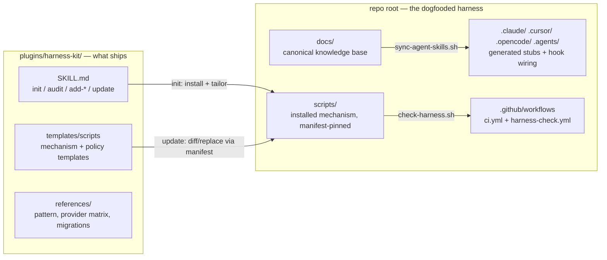

# Architecture

This repository is three things at once, and the boundaries between them are
the main thing to understand:

1. **A plugin marketplace** — `.claude-plugin/marketplace.json` at the root
   lets `/plugin marketplace add <owner>/harness-kit` work directly against
   this repo.
2. **The distributed plugin** — everything under `plugins/harness-kit/`. When a user
   installs the plugin, Claude Code copies the `plugins/harness-kit/` directory (the
   marketplace entry's `source`) into its cache — *only* that directory.
   This is why the plugin lives in a subdirectory: nothing at the repo root
   ships.
3. **A live installation of the kit** — the repo root is a working harness,
   installed and tailored by the kit's own `init` flow. It is both the
   dogfood loop and the browsable example.

## The three layers

The kit distinguishes **mechanism** (copied verbatim, upgraded via manifest),
**policy** (templates with `TAILOR` blocks, filled at init, never
auto-overwritten), and **content** (authored per-project). The canonical
description lives in the shipped pattern doc —
[plugins/harness-kit/skills/harness-kit/references/pattern.md](../../plugins/harness-kit/skills/harness-kit/references/pattern.md)
— which is the single source of truth for the pattern itself; this file only
describes how *this repo* embodies it.

## The dogfood loop

The root harness is a real installation, so kit development follows the same
lifecycle a user's repo does:

1. Improve a template under `plugins/harness-kit/skills/harness-kit/templates/`.
2. An advisory stop-hook (`scripts/hooks/guard-project-policy.sh`) warns if
   the change carries no regression test or the plugin version was never
   bumped — the same "advise, never block" philosophy the kit ships.
3. Roll the change into the root installation via the kit's **update** mode:
   files whose checksum still matches `scripts/.harness-manifest` are
   replaced; tailored files get a diff, never an overwrite. Forgetting this
   step fails CI: `scripts/test-template-sync.sh` (root-only, run by
   `check-harness.sh`) requires every non-tailored installed file to be
   byte-identical to its template — see
   [ADR 006](decisions/006-dogfood-copies-are-enforced-duplicates.md).
4. `scripts/verify.sh` gates the release: cheap shellcheck and manifest checks
   fail fast, then independent template regressions, eval validation, and the
   nested harness check run concurrently behind one reporting barrier.
   `ci.yml` executes `bash scripts/verify.sh` directly (plus
   `harness-check.yml` for the shipped drift-gate template), so the gate list
   can never drift from this executable definition.

Anything that breaks in this loop breaks here first, before it ships.

## Why the root files never ship

Plugin installs copy the entire plugin source directory and offer no
include/exclude mechanism. The only clean isolation is directory boundaries:
the marketplace entry points at `./plugin`, so the dogfood harness (docs,
installed scripts, provider dirs, CI) stays out of every user install while
remaining fully visible to anyone browsing the repo.

## Decision records

The load-bearing choices — and the trade-offs they accepted — are documented
as ADRs in [decisions/](decisions/README.md). Start there to understand *why*
the pattern looks the way it does before changing it.
